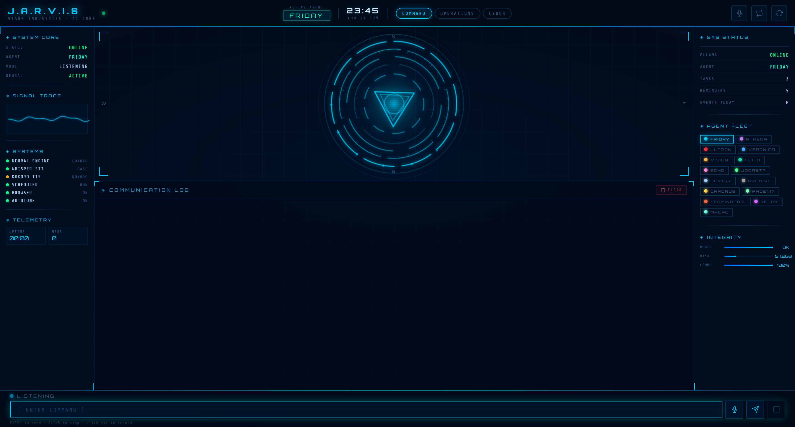

# FRIDAY (JARVIS) — Local AI Personal Assistant

A privacy-first, fully-local AI assistant with a multi-agent architecture, voice I/O, a 3-mode Iron-Man HUD, and a built-in cybersecurity toolkit. Runs entirely on your own machine — no cloud inference, no API keys for the core LLM.

> *FRIDAY is the default conversational agent; the system as a whole is JARVIS.*

---

## Screenshot

> _Command Mode — arc-reactor core, live system telemetry, 15-agent fleet._


<!-- Drop a screenshot of http://localhost:5000 here. Operations & Cyber tabs in docs/ too. -->

---

## Highlights

- **100% local LLM inference** via [Ollama](https://ollama.com) (`qwen2.5:7b`) — no OpenAI/Gemini/cloud
- **3-mode HUD** (Command / Operations / Cyber) — arc-reactor orb, live `/health` telemetry, 15-agent fleet, all vanilla JS + Canvas
- **Multi-agent architecture** — 15 specialized agents behind a dual-path intent router
- **Voice in + out** — faster-whisper STT (CUDA) + Kokoro-82M neural TTS (per-agent voices + earcons), barge-in interrupt, edge-tts fallback
- **AutoTune** — context-adaptive sampling (classifies each query → code/analytical/creative/conversational/chaotic → tunes temperature/top-p/etc) with 👍/👎 EMA online learning
- **Cybersecurity agent (Ultron)** — native recon suite + a **180+ tool HackingTool fleet** (via WSL/Docker), NVD CVE search, VirusTotal, CVE→asset correlation, one-command bug-bounty workflow with PoC report
- **Unified memory + telemetry** — one facade across the vector/edith/tool/personal stores; SQLite-backed long-term memory; live per-agent telemetry feeding the HUD
- **Gated critic pass** — optional self-review (critique → revise) on high-stakes Ultron/Athena reports
- **Reliability engineering** — circuit breaker, LRU routing cache, shared API rate-throttle, startup config validator, structured rotating logs, **254-test regression suite**
- **Streaming** — token-by-token SSE responses with sentence-chunked TTS

---

## Architecture

```
            Browser UI (3-mode HUD)  ──SSE──►  Flask (app.py)
                                                  │
                                  brain.process_input_stream
                                  (emotion · memory · personality · routine-record)
                                                  │
                                  cognitive_loop  (route → execute → reflect)
                                                  │
              ┌───────────────────────────────────┼───────────────────────────┐
          router                              executor ──► tools_registry ──► 15 agents
   (regex fast-path + O(1) exact →           (per-step dispatch)                 │
    LLM classify → clarify → fallback)                                    ask_llm()  ──► Ollama
                                                            (circuit breaker · LRU cache · AutoTune · per-agent model routing)
```

- **Router**: O(1) exact-command table + regex fast-path (instant) → LLM intent classifier (cached) → confidence-gated clarification → safe fallback
- **ask_llm()**: single gateway to Ollama — circuit breaker (fail-fast when down), LRU cache, AutoTune sampling, and per-agent model routing all funnel through this one node
- **No import cycles** (verified via knowledge-graph analysis, 904 nodes)

## Agents

| Agent | Codename | Role |
|-------|----------|------|
| **FRIDAY** | FRIDAY | Conversational assistant — tasks, goals, notes, habits, health, calendar, reminders |
| **Ultron** | ULTRON | Cybersecurity — recon, vuln scanning, CVE tracking/correlation, VirusTotal, HackingTool fleet, bug-bounty workflow |
| **Athena** | ATHENA | Deep research — multi-source aggregation, GitHub repo/code search |
| **Vision** | VISION | News, web search (DuckDuckGo), sports, crypto/FX, translation, flight tracking, Hacker News |
| **Veronica** | VERONICA | Browser automation (Playwright) — search, navigate, extract |
| **Edith** | EDITH | Project/long-term memory |
| **Echo** | ECHO | Dynamic tool generation |
| **Personal** | JOCASTA | User facts & profile |
| **System** | SENTRY | OS/CPU/RAM, battery, speed test, tool-result recall |
| **File** | ARCHIVE | Read/summarize documents (PDF/DOCX/audio via MarkItDown), apply patches |
| **Scheduler** | CHRONOS | Recurring background tasks |
| **Self-Improvement** | PHOENIX | Response-quality analysis |
| **Terminator** | TERMINATOR | Windows desktop control (pywinauto) — focus/type/click/launch apps |
| **n8n** | RELAY | Trigger self-hosted n8n automation workflows |
| **Routines** | MACRO | Record & replay command-sequence macros |

## Cybersecurity capabilities (Ultron)

- **Recon**: Nmap (with scan diffing), Subfinder, HTTPX, Katana, screenshots
- **HackingTool fleet**: 180+ pentest/OSINT tools (Amass, theHarvester, Holehe, Maigret, SpiderFoot, TruffleHog, Nuclei, …) run via WSL/Docker, behind a scoped allowlist — recon/OSINT/audit tools enabled, offensive categories blocked, no arbitrary shell
- **Vuln scanning**: Nuclei (severity-filtered)
- **Threat intel**: NVD CVE search, CVE tracking/watchlist, VirusTotal (file/hash/URL/domain/IP)
- **Correlation**: cross-links tracked CVEs against scanned host services ("am I exposed?")
- **Bug-bounty workflow**: `bug bounty <target>` → recon → parse findings → exploit lookup → validate → clean PoC report
- **Hardening built-in**: SSRF guard (blocks internal/metadata IPs), shell-command allowlist + injection sanitizer, shared API rate-throttle
- *Authorized targets only.*

---

## Tech Stack

**Backend**: Python · Flask (SSE streaming) · Ollama (qwen2.5:7b)
**Frontend**: vanilla JS + Canvas HUD (no framework) · 3-mode Command Center
**Voice**: faster-whisper (CUDA) · Kokoro-82M TTS · edge-tts (fallback) · barge-in
**Cognition**: AutoTune adaptive sampling + EMA feedback · per-agent model routing
**Memory**: TF-IDF vector memory · JSON stores · knowledge-graph analysis
**Security tooling**: Nmap · Nuclei · Subfinder · HTTPX · Katana · HackingTool fleet (WSL/Docker) · NVD · VirusTotal
**Other**: Playwright · pywinauto · MarkItDown · DuckDuckGo · football-data.org · n8n

## Setup

```bash
# 1. Install Ollama + pull a model
ollama pull qwen2.5:7b

# 2. Python deps
pip install -r requirements.txt
playwright install chromium

# 3. Config
cp .env.example .env          # add API keys (all optional)

# 4. Run
python app.py                 # → http://localhost:5000
```

On boot, a **config validator** prints a readiness summary (Ollama reachable, model pulled, optional keys, security tools, HackingTool backend) — loud about what's missing, never fatal.

**Optional API keys** (features degrade gracefully without them): NVD, VirusTotal, football-data.org, GitHub token, n8n.
**Security tools**: Nmap + ProjectDiscovery suite on PATH for the native fast-path; WSL or Docker Desktop for the 180+ HackingTool fleet.

## Testing

```bash
python test_regression.py     # 30 sections, 254 tests, HTML report
```

Covers all 15 agents, router patterns, security helpers + HackingTool gates, SSRF guard, circuit breaker, AutoTune + model routing, API throttle, config validator, memory, TTS, and live-API integrations (skipped when offline).

---

## Status

Feature-complete core. Local assistant + voice + 3-mode HUD + cybersecurity toolkit, all functional and tested (254 tests green).

*Built as a learning project exploring local LLM orchestration, multi-agent design, adaptive cognition, and AI-assisted security workflows.*
